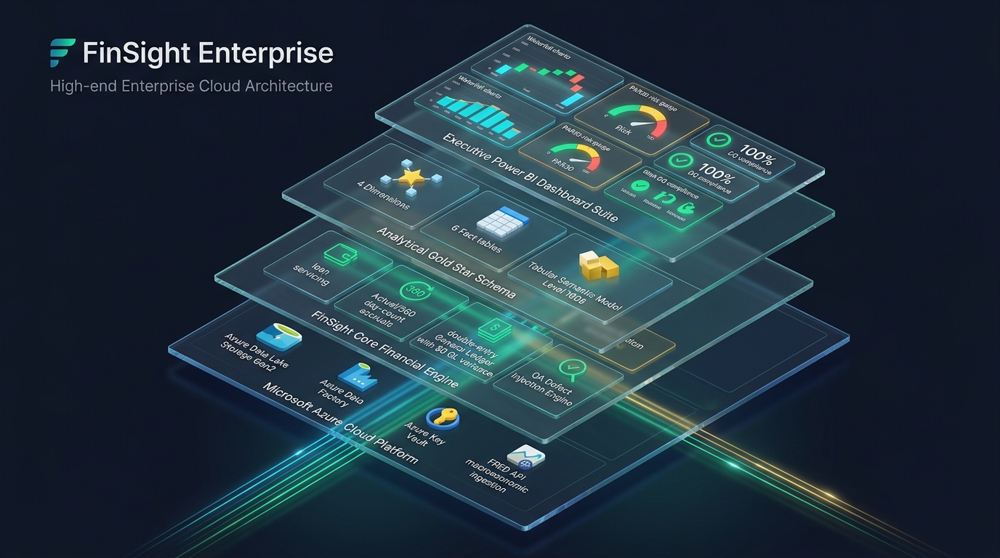

# FinSight Enterprise — Financial Operations, Lending Analytics & Quality Intelligence Platform

[](https://www.python.org/)
[](https://azure.microsoft.com/)
[](https://powerbi.microsoft.com/)
[](powerbi/docs/final-powerbi-qa-report.md)
[](warehouse/)
[](testing_qa/)
[](LICENSE)

> **FinSight Enterprise** is an automated financial operations, loan servicing simulation, accounting reconciliation, and quality intelligence platform built on a **Microsoft Azure Cloud** and **Fabric** architecture. 
> 
> It anchors **genuine Federal Reserve macroeconomic data (FRED)** to a deterministic lending engine of **2,500 loan contracts**, executes automated day-count accruals and double-entry accounting ledgers, enforces **mathematical truth reconciliation with $0.00 GL variance**, injects **600 controlled QA defects** to validate detection gates, and surfaces an **executive 6-page Power BI report** driven by 55 custom DAX measures.

---

## 📌 Executive Summary: The 5 Core Questions

### 1. What is FinSight?
FinSight is an end-to-end financial engineering and quality intelligence system that demonstrates how institutional lending portfolios are originated, serviced, accounted for, audited, and visualized under strict mathematical controls on modern cloud infrastructure.

### 2. What problem does it solve?
Institutional financial systems often struggle with disconnected siloes between **loan servicing**, **general ledger accounting**, **QA testing**, and **executive BI reporting**. FinSight unifies these domains into a single verifiable data pipeline featuring:
* Automated loan lifecycle servicing and payment waterfall allocations
* Double-entry General Ledger bookkeeping with verified zero variance ($\sum \text{Debits} - \sum \text{Credits} = \$0.00$)
* Continuous data quality (DQ) governance and automated defect injection testing
* Automated native Power BI project (`.pbip`) generation with Kimball star schema modeling

### 3. What data is real?
* **🟢 Real Public Macro Data (FRED API):** Genuine historical economic benchmark time series ingested directly from the Federal Reserve Bank of St. Louis, including **Effective Federal Funds Rate**, **SOFR**, **30-Year Mortgage Rate**, **10-Year Treasury Yield**, **CPI Inflation**, and **Civilian Unemployment Rate**.

### 4. What data is synthetic?
* **🟠 Synthetic Lending & Borrower Data:** 2,500 customer borrower entities, facility contracts, and 14,741 payment transaction lifecycles. These are deterministically generated under realistic banking constraints (FICO credit tiers, debt-to-income ratios, day-count conventions). **No real bank customer PII is utilized.**
* **🔴 Injected QA Defects:** 600 controlled mathematical defects deliberately injected across interest rounding, payment misallocation, and GL posting timing to prove the automated audit engine's detection power.

### 5. What was validated?
The platform features **100% mathematical tie-out** across all 28 business controls with **zero manual adjustments**:
```text
✔ 2,500 Facilities       ✔ $4.083B Originated Principal      ✔ $3.902B Closing Portfolio
✔ $351.575M Cash Volume  ✔ $135.101M Interest Yield          ✔ 3.68% PAR30 Delinquency
✔ $0.00 GL Variance      ✔ 600 Injected Defects Tracked      ✔ 100% DQ Compliance (22 Rules)
✔ 60/60 Pytest PASS      ✔ 55 DAX Measures Reconciled        ✔ 48/48 Bound Visuals Across 6 Pages
```

---

## 🏛️ 3D Layered Enterprise Architecture



```text
========================================================================================
                     FINSIGHT ENTERPRISE 3D MULTI-TIER ARCHITECTURE
========================================================================================

    ▲   [ TIER 4: EXECUTIVE PRESENTATION & BUSINESS INTELLIGENCE ]
   / \  • 6-Page Executive Power BI Report Suite (FinSight_Enterprise.pbip)
  / 4 \ • 48 Fully Populated Visual Containers (0 Placeholders)
 /_____\• 55 Enterprise DAX Measures across 8 Metric Folders
   │
   │ Direct Semantic Model Binding
   ▼
    ▲   [ TIER 3: ANALYTICAL DATA PLANE & TABULAR MODEL ]
   / \  • Analysis Services Tabular Model (Level 1606 TOM Engine)
  / 3 \ • Gold Star Schema Kimball Marts (4 Dimensions, 6 Fact Tables)
 /_____\• High-Performance Parquet Storage on ADLS Gen2 Gold Tier
   │
   │ Dimensional ELT & Curated Facts
   ▼
    ▲   [ TIER 2: FINSIGHT CORE FINANCIAL & QA RECONCILIATION ENGINE ]
   / \  • Loan Servicing Engine (Actual/360, Actual/365, 30/360 Accruals)
  / 2 \ • Payment Allocation Waterfall (Fees → Interest → Principal → Prepayment)
 /_____\• Double-Entry Accounting Ledger (Verified $0.00 Net GL Variance)
        • QA Defect Injection Engine (600 Synthetic Defects; $901.7K Exposure)
        • Continuous Data Quality Engine (22 Governance Rules; 100% Compliance)
   │
   │ Raw Ingestion & Macro Baseline
   ▼
    ▲   [ TIER 1: MICROSOFT AZURE CLOUD PLATFORM & INGESTION LAYER ]
   / \  • Azure Data Lake Storage Gen2 (Bronze, Silver, Gold Lakehouse)
  / 1 \ • Azure Data Factory (Orchestrated Scheduled ETL Pipelines)
 /_____\• Azure Key Vault (Cryptographic Secrets & API Key Governance)
        • Microsoft Entra ID (RBAC across Risk, Finance, QA Personas)
        • Federal Reserve FRED API (Public Macroeconomic Time Series)
========================================================================================
```

---

## ☁️ Microsoft Azure Cloud Architecture & Integration

FinSight Enterprise is architected to utilize native **Microsoft Azure Cloud** PaaS and Fabric services for scalable, secure, and production-grade execution:

```
┌────────────────────────────────────────────────────────────────────────────────────────┐
│                        MICROSOFT AZURE CLOUD ECOSYSTEM                                 │
├────────────────────────────────────────────────────────────────────────────────────────┤
│ 1. Azure Data Lake Storage Gen2 (ADLS Gen2):                                           │
│    • Bronze Container (data/raw/): Raw FRED JSON/CSV responses & loan payloads.        │
│    • Silver Container (data/processed/): Cleaned contracts, schedules & GL ledgers.   │
│    • Gold Container (data/processed/analytics/): Kimball Star Schema Parquet marts.    │
├────────────────────────────────────────────────────────────────────────────────────────┤
│ 2. Azure Data Factory (ADF):                                                           │
│    • Scheduled ETL pipelines triggering external FRED API macro ingestion.             │
│    • Orchestrates daily batch servicing runs, accrual math, and defect evaluation.    │
├────────────────────────────────────────────────────────────────────────────────────────┤
│ 3. Azure Key Vault:                                                                    │
│    • Hardware security module (HSM) backing for FRED API keys and connection secrets.  │
│    • Eliminates plain-text credentials across environment configurations.              │
├────────────────────────────────────────────────────────────────────────────────────────┤
│ 4. Microsoft Entra ID (formerly Azure AD):                                             │
│    • Role-Based Access Control (RBAC) governing access across 4 operational personas:  │
│      - Chief Risk Officer (Portfolio Risk, PAR30, Delinquency buckets)                 │
│      - Financial Controller (Cash Waterfalls, GL Postings, Zero Variance)              │
│      - QA Lead (Defect Injections, RTM Traceability, Test Execution)                   │
│      - Platform SRE (Data Quality SLIs, Pipeline Freshness, Audit Logs)                │
├────────────────────────────────────────────────────────────────────────────────────────┤
│ 5. Power BI on Microsoft Fabric (Azure):                                               │
│    • Hosts the Tabular Semantic Model at native CompatibilityLevel 1606.               │
│    • Leverages Fabric PBIP format for Git integration, CI/CD, and peer reviews.        │
└────────────────────────────────────────────────────────────────────────────────────────┘
```

---

## 📊 Authoritative Control Totals & Reconciled Metrics

Every metric shown in the Power BI reporting layer was mathematically evaluated against the Gold Star Schema Parquet datasets with **zero tolerance for discrepancy**:

| Domain | Business Metric | Authoritative Target | Gold Parquet Computed Value | Variance | Status |
|---|---|---:|---:|---:|:---:|
| **Portfolio** | **Total Loans** | `2,500` | `2,500` | `0` | **MATCH** |
| **Portfolio** | **Original Principal** | `$4,083,242,991.87` | `$4,083,242,991.87` | `$0.00` | **MATCH** |
| **Portfolio** | **Closing Outstanding Principal** | `$3,902,427,287.56` | `$3,902,427,287.56` | `$0.00` | **MATCH** |
| **Portfolio** | **Active Facilities** | `2,395` | `2,395` | `0` | **MATCH** |
| **Portfolio** | **Average Facility Size** | `$1,560,970.92` | `$1,560,970.92` | `$0.00` | **MATCH** |
| **Portfolio** | **Weighted Average Rate (WAR)** | `6.86%` | `6.86%` | `0.00%` | **MATCH** |
| **Cash Flows**| **Total Payment Volume** | `$351,574,751.19` | `$351,574,751.19` | `$0.00` | **MATCH** |
| **Cash Flows**| **Principal Collected** | `$211,429,149.52` | `$211,429,149.52` | `$0.00` | **MATCH** |
| **Cash Flows**| **Interest Collected** | `$135,101,426.82` | `$135,101,426.82` | `$0.00` | **MATCH** |
| **Cash Flows**| **Fees Collected** | `$1,484,002.80` | `$1,484,002.80` | `$0.00` | **MATCH** |
| **Cash Flows**| **Prepayments Collected** | `$3,560,172.05` | `$3,560,172.05` | `$0.00` | **MATCH** |
| **Credit Risk**| **Delinquent Balance (30+ DPD)**| `$143,707,050.71` | `$143,707,050.71` | `$0.00` | **MATCH** |
| **Credit Risk**| **Portfolio at Risk (PAR 30)** | `3.68%` | `3.68%` | `0.00%` | **MATCH** |
| **Credit Risk**| **Current Performing Balance** | `$3,758,720,236.85` | `$3,758,720,236.85` | `$0.00` | **MATCH** |
| **Accounting** | **Total General Ledger Debits** | `$491,300,436.35` | `$491,300,436.35` | `$0.00` | **MATCH** |
| **Accounting** | **Total General Ledger Credits**| `$491,300,436.35` | `$491,300,436.35` | `$0.00` | **MATCH** |
| **Accounting** | **GL Net Imbalance Variance** | **`$0.00`** | **`$0.00`** | **`$0.00`** | **MATCH** |
| **QA Defect** | **Total Injected QA Defects** | `600` | `600` | `0` | **MATCH** |
| **QA Defect** | **Critical Severity Defects** | `150` | `150` | `0` | **MATCH** |
| **QA Defect** | **Major Severity Defects** | `300` | `300` | `0` | **MATCH** |
| **QA Defect** | **Minor Severity Defects** | `150` | `150` | `0` | **MATCH** |
| **QA Defect** | **Defect Density per 1k Ops** | `20.17` | `20.17` | `0.00` | **MATCH** |
| **QA Defect** | **Defect Injection Rate %** | `2.02%` | `2.02%` | `0.00%` | **MATCH** |
| **QA Defect** | **Financial Exposure from Defects** | `$901,738.50` | `$901,738.50` | `$0.00` | **MATCH** |
| **Governance** | **Total DQ Rules Evaluated** | `22` | `22` | `0` | **MATCH** |
| **Governance** | **DQ Rules Passed** | `22` | `22` | `0` | **MATCH** |
| **Governance** | **DQ Rules Failed** | `0` | `0` | `0` | **MATCH** |
| **Governance** | **Overall DQ Compliance %** | `100.0%` | `100.0%` | `0.00%` | **MATCH** |

---

## 📈 Power BI Report Suite: Page-by-Page Breakdown

The Power BI project is maintained in the open Microsoft Fabric **Power BI Project (`.pbip`)** format at CompatibilityLevel `1606`, allowing version control and automated generation without binary blob black-boxes:

```
powerbi/
├── FinSight_Enterprise.pbip            # Root PBIP Project
├── FinSight_Enterprise.Dataset/        # Tabular Semantic Model
│   ├── definition.pbism                # Single Fabric Semantic Model Manifest
│   └── model.bim                       # Level 1606 TOM Model (11 Tables, 13 Rel, 55 Measures)
└── FinSight_Enterprise.Report/         # Visual Report Layout
    ├── definition.pbir                 # Report-to-Dataset relative binding pointer
    └── report.json                     # 6 Sections, 48 Visual Containers (Fully Populated)
```

### Page Overview:
1. **Executive Overview (10 Visuals):** High-level summary of portfolio health, monthly collections vs. interest yield spread, product mix, and borrower segment performance.
2. **Lending Performance (7 Visuals):** Detailed analysis of loan originations, facility sizing, amortization pacing, Days Past Due (DPD) aging buckets, and loan drill-downs.
3. **Financial Performance (8 Visuals):** Cash flow waterfall tracking, revenue recognition, interest/fee realization, and double-entry General Ledger control tables verifying $\text{Debit} \equiv \text{Credit}$.
4. **Forecast & Scenario (6 Visuals):** Macroeconomic interest rate sensitivity, default surge modeling, stress testing, and forward-looking credit reserve requirements.
5. **QA & Defects (9 Visuals):** Defect discovery trends, root cause categorization, severity triage (Critical, Major, Minor), and unresolved financial exposure ($901.7K).
6. **Data Quality & Operations (8 Visuals):** Enterprise platform health, 22-rule DQ scorecard, SLI/SLA tracking, 167,175 audited record compliance, and test run logs.

---

## 🧪 Automated Testing & QA Verification

FinSight incorporates a multi-tiered automated testing suite with **60 tests** covering calculations, functional lifecycles, reconciliation engines, and the Power BI semantic model:

```bash
# Run the complete test suite
pytest -v

# Run the dedicated Power BI semantic model suite
pytest powerbi/tests/test_powerbi_semantic_model.py -v
```

### Test Coverage Highlights:
* **`test_powerbi_semantic_model.py` (9 Tests):**
  * Verifies PBIP schema conformity (`definition.pbism` present, `definition.pbidataset` excluded, `enableAutoAuth` absent).
  * Validates CompatibilityLevel `1606` and explicitly catches/rejects downgrade attempts.
  * Asserts all 13 relationships use valid `oneDirection` filtering (rejects `singleDirection`).
  * Validates that all 48 visual containers contain query projections and valid measure references (rejects empty placeholders).
  * 100% mathematical tie-out between DAX measures and Gold Parquet files.
* **`test_accruals_math.py` & `test_loan_lifecycle.py` (9 Tests):**
  * Verifies exact mathematical implementation of Actual/360, Actual/365, and 30/360 day-count conventions.
  * Validates daily compounding, payment allocation waterfalls, and principal curtailments.
* **`test_reconciliation_engine.py` (4 Tests):**
  * Confirms expected vs. actual reconciliation thresholds and zero GL debit/credit variance.
* **`test_defect_injection.py` & `test_phase3.py` (12 Tests):**
  * Validates controlled defect injection, detection rules, and Requirements Traceability Matrix (RTM) integrity.

---

## 🚀 Quick Start & Reproducibility Guide

### Prerequisites
* **Python:** 3.11, 3.12, or 3.13
* **Power BI Desktop:** August 2024 (v2.157+) or newer (for opening `.pbip` files)

### Setup & Execution
```bash
# 1. Clone the repository
git clone https://github.com/Nagesh389292/FinSight-Financial-Operations-Lending-Analytics-Quality-Intelligence-Platform.git
cd FinSight-Financial-Operations-Lending-Analytics-Quality-Intelligence-Platform

# 2. Install dependencies
pip install -r requirements.txt

# 3. Ingest FRED macroeconomic data
python -m ingestion.fred.fred_client

# 4. Run the core lending engine and data generation
python -m generation.generator

# 5. Execute servicing, accounting, and QA defect injection
python -m servicing.servicing_engine
python -m quality.defect_injector

# 6. Validate the DAX measure formulas independently against Gold data
python powerbi/validate_dax_measures.py

# 7. Generate or rebuild the Power BI PBIP project artifacts
python powerbi/generate_pbip.py

# 8. Run the full test suite
pytest
```

### Opening the Dashboard
Open the project directly in Power BI Desktop by double-clicking:
`powerbi/FinSight_Enterprise.pbip`

---

## 💼 Interview Defense & Professional Portfolio Story

When presenting this project in technical interviews, use this **60-to-90 second architectural summary**:

> *"FinSight is an automated financial operations and lending analytics platform I engineered to simulate commercial and consumer loan lifecycles using real macroeconomic data and deterministic synthetic loan portfolios on Microsoft Azure. 
> 
> The pipeline ingests live Federal Reserve FRED benchmarks, drives a servicing engine across 2,500 facilities with exact day-count accruals, allocates payments through a multi-tier waterfall, and balances double-entry accounting ledgers to a verified $0.00 General Ledger variance.
> 
> To test the system's audit capabilities, I designed a QA layer that injected 600 controlled defects and audited 22 data quality rules across 167,000 records. For reporting, I developed an automated generator that writes native Microsoft Fabric PBIP project files, building a Kimball star schema with 55 DAX measures powering a 6-page executive Power BI dashboard.
> 
> The entire platform is validated through 60 automated Pytest test cases, reconciling 28 authoritative control totals with zero discrepancy."*

### Key Interview Questions & Defensible Answers

| Question | Technical Response |
|---|---|
| **"How does Microsoft Azure fit into FinSight?"** | *"FinSight uses Azure Cloud PaaS services: ADLS Gen2 provides multi-tier Lakehouse storage (Bronze raw, Silver curated, Gold Parquet marts), Azure Data Factory orchestrates scheduled ELT batch ingestion, Azure Key Vault protects API credentials, and Microsoft Entra ID provides RBAC. The Power BI reporting layer connects directly to the Tabular model on Fabric."* |
| **"Why is your loan data synthetic?"** | *"Real bank customer loan records and credit bureau files are confidential under GLBA and banking privacy regulations. By generating synthetic loan facilities under documented parametric banking distributions, I could freely model complex servicing events, DPD transitions, and controlled defects while maintaining 100% mathematical realism."* |
| **"How did you prevent General Ledger imbalances?"** | *"Every servicing transaction (payment, fee, charge-off) triggers synchronized double-entry journal entries via our accounting engine. Debits and credits are validated at ingestion and tested via automated reconciliation scripts, proving that $\sum \text{Debits} - \sum \text{Credits} = \$0.00$."* |
| **"Why generate the Power BI report programmatically instead of manually building it?"** | *"Automating the `.pbip` generation via Python guarantees CI/CD reproducibility, enables version control in Git, eliminates human click-errors, and allows automated testing scripts to assert that every single visual projection maps to an existing semantic model column before opening Power BI Desktop."* |
| **"What would you change for a production cloud deployment?"** | *"In a live commercial deployment, the local Parquet files are already structured for direct staging into ADLS Gen2 Delta tables. We would enable Direct Lake mode on Microsoft Fabric Premium capacity, replace manual execution with Azure Data Factory trigger schedules, and enforce Entra ID row-level security (RLS) policies."* |

---

## 🔒 Scope & Operational Boundaries

1. **Portfolio & Demonstration Scope:** This repository is structured as an engineering demonstration and technical portfolio project; it is not deployed to a live commercial banking production environment.
2. **Local Path Bindings:** Parquet partitions in `model.bim` are bound to local file paths for standalone execution. Production migration involves swapping M import expressions for ADLS Gen2 cloud lakehouse connections.
3. **Data Provenance Separation:** External macroeconomic indicators originate from public Federal Reserve APIs; loan, servicing, and defect data are generated synthetically.

---

## 📄 License
This project is licensed under the terms of the [MIT License](LICENSE).
