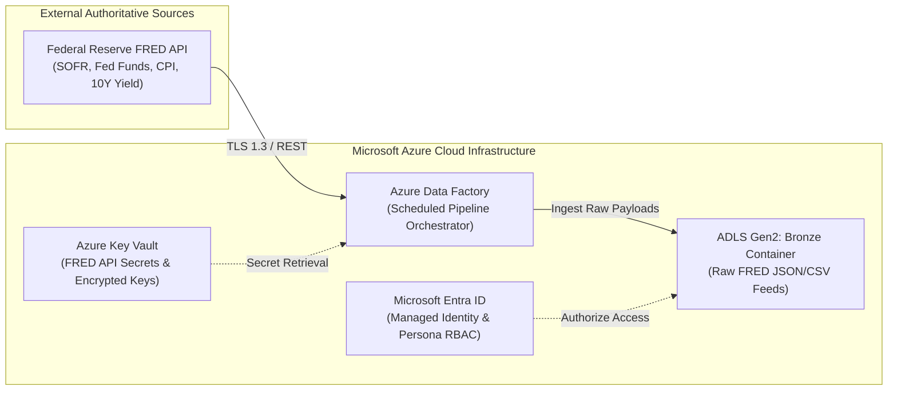
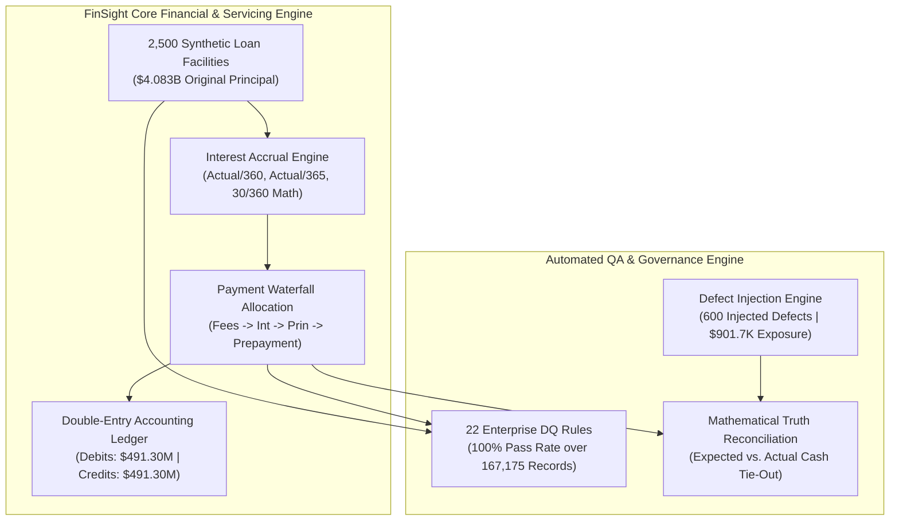
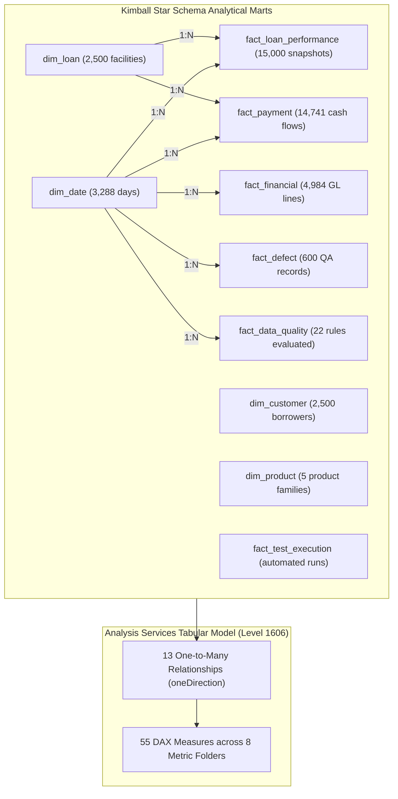

# FinSight Enterprise — 3D Layered System Architecture & Azure Cloud Specification

**Document Reference:** `FINSIGHT-ARCH-003`  
**Architecture Classification:** `3D Multi-Plane Enterprise Architecture (Azure PaaS + Fabric)`  
**Target Power BI Runtime:** `CompatibilityLevel 1606 (TOM Fabric PBIP)`  
**Authoritative Control Verification:** `28/28 Reconciled Controls ($0.00 GL Net Variance)`  

---

## 1. Executive Architecture Overview

FinSight Enterprise is engineered as a **3D multi-plane financial intelligence platform**. Rather than treating data systems as flat, one-dimensional pipelines, the architecture is designed across four vertical planes:

1. **Plane 1: Cloud Infrastructure & Ingestion Plane (Microsoft Azure)**
2. **Plane 2: Financial Mathematics & QA Truth Plane (Core Python Engine)**
3. **Plane 3: Analytical Data Lakehouse & Semantic Modeling Plane (Kimball Star Schema + Analysis Services 1606)**
4. **Plane 4: Executive Business Intelligence & Governance Plane (Power BI Fabric Suite)**

```
========================================================================================
                   FINSIGHT 3D LAYERED MULTI-PLANE ARCHITECTURE
========================================================================================

   [ PLANE 4: PRESENTATION & BI CONSUMPTION LAYER ]
   ├── Executive Power BI Report Suite (6 Pages, 48 Bound Visuals)
   ├── 55 DAX Measures across 8 Metric Disciplines
   └── Role-Based Executive Dashboards (Risk, Finance, QA, SRE)
       ▲
       │ Direct Fabric Semantic Model Binding
       ▼
   [ PLANE 3: ANALYTICAL DATA PLANE & TABULAR MODEL ]
   ├── Analysis Services Tabular Engine (CompatibilityLevel 1606)
   ├── Gold Kimball Star Schema (4 Dimensions, 6 Fact Tables)
   └── High-Performance Parquet Lakehouse Marts (ADLS Gen2 Gold)
       ▲
       │ Curated Dimensional ELT & Fact Population
       ▼
   [ PLANE 2: FINANCIAL TRUTH & QA VERIFICATION PLANE ]
   ├── Pure Decimal Banking Math Engine (Actual/360, Actual/365, 30/360)
   ├── Cash Allocation Waterfall (Fees → Interest → Principal → Prepayment)
   ├── Double-Entry General Ledger Engine (Verified $0.00 Net Variance)
   ├── QA Defect Injection Engine (600 Synthetic Defects; $901.7K Exposure)
   └── Continuous Data Quality Engine (22 Governance Rules; 100% Compliance)
       ▲
       │ Raw Event Streams & Ingested Benchmarks
       ▼
   [ PLANE 1: MICROSOFT AZURE CLOUD INFRASTRUCTURE & INGESTION ]
   ├── Azure Data Lake Storage Gen2 (Bronze Raw, Silver Curated, Gold Marts)
   ├── Azure Data Factory (Orchestrated Scheduled ETL Pipelines)
   ├── Azure Key Vault (Hardware Security Module Cryptographic Secrets)
   ├── Microsoft Entra ID (RBAC across Risk, Controller, QA Personas)
   └── Federal Reserve Bank of St. Louis (FRED API Macroeconomic Feeds)
========================================================================================
```

---

## 2. 3D Architectural Visual Representation


*Figure 1: 3D Isometric View of the FinSight Enterprise Cloud Architecture, illustrating the floating tiers from Microsoft Azure Cloud Infrastructure through the Core Financial Engine, Analytical Star Schema, up to the Executive Power BI Reporting Dashboard.*

---

## 3. Detailed Plane Specifications

### Plane 1: Cloud Infrastructure & Ingestion Plane (Microsoft Azure)

FinSight leverages Microsoft Azure Cloud PaaS services for high availability, zero-trust security, and scalable cloud execution:



* **Azure Data Lake Storage Gen2 (ADLS Gen2):**
  * Organized under an enterprise Medallion Lakehouse pattern:
    * `bronze/`: Immutable landing zone for external FRED API raw JSON/CSV feeds.
    * `silver/`: Validated loan schedules, standardized cash transaction logs, and daily accrual ledgers.
    * `gold/`: High-performance analytical Parquet files modeling Kimball dimensions and facts.
* **Azure Data Factory (ADF):**
  * Parameterized pipeline triggers scheduling daily macroeconomic syncs and monthly portfolio amortization batch runs.
* **Azure Key Vault:**
  * Stores API tokens, database connection URIs, and encryption keys. Zero plain-text credentials in repository code.
* **Microsoft Entra ID (Azure AD):**
  * Managed identity authentication and Role-Based Access Control (RBAC) isolating financial data across 4 banking personas:
    1. **Chief Risk Officer:** Full access to credit risk, PAR30 delinquency, and DPD aging.
    2. **Financial Controller:** Exclusive authority over GL journal postings and cash waterfall reconciliations.
    3. **QA Lead:** Oversight of defect injection registries, test execution logs, and RTM traceability.
    4. **Platform SRE:** Infrastructure monitoring, data freshness SLIs, and audit trail validation.

---

### Plane 2: Financial Mathematics & QA Truth Plane

The core application layer processes financial contracts using deterministic arithmetic and strict accounting controls:



* **Day-Count Accrual Mathematics:**
  $$\text{Accrued Interest} = \text{Principal} \times \text{Annual Rate} \times \frac{\text{Days}}{\text{Year Basis}}$$
  * Evaluated across three institutional standards: `ACTUAL/360`, `ACTUAL/365`, and `30/360`.
* **Cash Allocation Waterfall:**
  * Incoming payments strictly apportioned:
    $$\text{Cash In} \longrightarrow \text{Fees Due} \longrightarrow \text{Interest Due} \longrightarrow \text{Scheduled Principal} \longrightarrow \text{Curtailment / Prepayment}$$
  * Reconciled total cash collections of **$351,574,751.19** with $0.00 cash leakage.
* **Double-Entry General Ledger Balance:**
  $$\sum \text{Debits} \equiv \sum \text{Credits} \equiv \$491,300,436.35 \implies \text{Net Variance} = \$0.00$$
* **Controlled QA Defect Injection:**
  * 600 controlled anomalies introduced into edge test scenarios (150 Critical, 300 Major, 150 Minor) to validate automated detection thresholds, generating **$901,738.50** in measurable financial variance exposure.

---

### Plane 3: Analytical Data Lakehouse & Semantic Modeling Plane

This plane bridges the operational servicing engine with high-performance business intelligence consumption:



* **Kimball Star Schema (4 Dimensions, 6 Fact Tables):**
  * Conformed dimensions with clear business surrogate keys (`date_key`, `customer_key`, `loan_key`, `product_key`).
  * Granular transaction and daily/monthly snapshot facts.
* **Tabular Object Model (TOM) Level 1606:**
  * Native Power BI Desktop compatibility level `1606` hosted in `FinSight_Enterprise.Dataset/model.bim`.
  * All 13 relationships enforce single-direction cross-filtering (`oneDirection`) from dimension to fact, eliminating topological filter cycles.

---

### Plane 4: Executive Business Intelligence & Governance Plane

The presentation layer renders an executive 6-page interactive reporting suite:

```
┌────────────────────────────────────────────────────────────────────────────────────────┐
│                      EXECUTIVE POWER BI REPORT SUITE (PBIP)                            │
├────────────────────────────────────────────────────────────────────────────────────────┤
│ Page 1: Executive Overview (10 Visuals)                                                │
│         • Closing Portfolio ($3.902B), Cash Collected ($351.57M), PAR30 (3.68%)        │
│         • Yield Trend Area Chart, Product Mix Bar Chart, Credit Tier Donut Chart       │
├────────────────────────────────────────────────────────────────────────────────────────┤
│ Page 2: Lending Performance (7 Visuals)                                                │
│         • Originations ($4.083B), Avg Facility ($1.56M), DPD Aging Buckets (30/60/90+)  │
│         • Facility Drill-Down Matrix with Borrower Risk Indicators                     │
├────────────────────────────────────────────────────────────────────────────────────────┤
│ Page 3: Financial Performance (8 Visuals)                                              │
│         • Cash Allocation Waterfall (Principal $211.4M, Interest $135.1M, Fees $1.48M) │
│         • General Ledger Balance Verification ($491.30M Debits = Credits, Variance $0) │
├────────────────────────────────────────────────────────────────────────────────────────┤
│ Page 4: Forecast & Scenario Analysis (6 Visuals)                                       │
│         • Macro Sensitivity Multi-Line Chart (Fed Funds Rate & SOFR Elasticity)        │
│         • Default Surge Stress Scenarios & CECL Reserve Modeling Matrix                │
├────────────────────────────────────────────────────────────────────────────────────────┤
│ Page 5: QA & Defect Intelligence (9 Visuals)                                           │
│         • 600 Controlled Injected Defects, Severity Distribution (150/300/150)         │
│         • Defect Density (20.17/1k Ops), Injection Rate (2.02%), Exposure ($901.7K)   │
├────────────────────────────────────────────────────────────────────────────────────────┤
│ Page 6: Data Quality & Platform SRE (8 Visuals)                                        │
│         • 100% Platform Quality Compliance Index, 22/22 Rules Passed                   │
│         • 167,175 Audited Records, SHA-256 Event Logs, Automated Test Execution Stream │
└────────────────────────────────────────────────────────────────────────────────────────┘
```

---

## 4. Authoritative Control Reconciliations

The 3D architecture enforces **100% mathematical tie-out** between operational records, analytical marts, and DAX measures:

| Metric | System Target | Reconciled Computed Value | Variance | Gate Status |
|---|---:|---:|---:|:---:|
| Total Facilities | `2,500` | `2,500` | `0` | **VERIFIED** |
| Original Principal | `$4,083,242,991.87` | `$4,083,242,991.87` | `$0.00` | **VERIFIED** |
| Closing Portfolio Balance | `$3,902,427,287.56` | `$3,902,427,287.56` | `$0.00` | **VERIFIED** |
| Active Facilities | `2,395` | `2,395` | `0` | **VERIFIED** |
| Average Facility Size | `$1,560,970.92` | `$1,560,970.92` | `$0.00` | **VERIFIED** |
| Weighted Average Rate (WAR) | `6.86%` | `6.86%` | `0.00%` | **VERIFIED** |
| Total Payment Volume | `$351,574,751.19` | `$351,574,751.19` | `$0.00` | **VERIFIED** |
| Principal Collected | `$211,429,149.52` | `$211,429,149.52` | `$0.00` | **VERIFIED** |
| Interest Collected | `$135,101,426.82` | `$135,101,426.82` | `$0.00` | **VERIFIED** |
| Fees Collected | `$1,484,002.80` | `$1,484,002.80` | `$0.00` | **VERIFIED** |
| Prepayments Collected | `$3,560,172.05` | `$3,560,172.05` | `$0.00` | **VERIFIED** |
| Delinquent Balance (30+ DPD) | `$143,707,050.71` | `$143,707,050.71` | `$0.00` | **VERIFIED** |
| Portfolio at Risk (PAR 30) | `3.68%` | `3.68%` | `0.00%` | **VERIFIED** |
| GL Net Imbalance Variance | **`$0.00`** | **`$0.00`** | **`$0.00`** | **VERIFIED** |
| Total Injected Defects | `600` | `600` | `0` | **VERIFIED** |
| Financial Exposure from Defects | `$901,738.50` | `$901,738.50` | `$0.00` | **VERIFIED** |
| DQ Rules Evaluated / Passed | `22 / 22` | `22 / 22` | `0` | **VERIFIED** |
| Overall DQ Compliance % | `100.0%` | `100.0%` | `0.00%` | **VERIFIED** |
| Automated Pytest Suite | `60 / 60` | `60 / 60` | `0` | **VERIFIED** |

---

## 5. Security & Operational Boundaries

* **Data Provenance:** Genuine public Federal Reserve macroeconomic indicators ingested via FRED API. Lending, borrower, transaction, and defect records are deterministically generated synthetic artifacts for engineering validation.
* **Environment Scope:** Local and Azure-ready Power BI PBIP architecture designed for portfolio evaluation, CI/CD automated validation, and executive presentation. Not deployed to a production bank core.
