# FinSight Enterprise — System Architecture Document

---

### 1. High-Level Enterprise Architecture

FinSight Enterprise combines an operational banking and servicing engine, a financial calculation truth engine, an automated quality engineering framework, an analytical data warehouse, a forecasting and scenario simulator, and multi-persona executive consumption layers.

```mermaid
flowchart TD
    subgraph Data_Inputs["1. Authoritative External Data & Controlled Operational Data"]
        FRED["Federal Reserve FRED API<br>(SOFR, Prime Rate, Fed Funds, 10Y Yield, CPI)"]
        SYNTH["Controlled Lending Simulator<br>(2,500+ Facilities, Payments, Accruals, Edge Cases)"]
    end

    subgraph Operational_Core["2. Transactional OLTP Core (PostgreSQL)"]
        subgraph Core_Schema["Schema: core"]
            TBL_CUST["core.customers"]
            TBL_LOAN["core.loans"]
            TBL_PAY["core.payments"]
            TBL_BILL["core.billing_statements"]
        end
        subgraph Finance_Schema["Schema: finance"]
            TBL_GL["finance.gl_accounts & journal_entries"]
            TBL_ACCR["finance.daily_accruals"]
            TBL_REC["finance.reconciliations"]
        end
        subgraph QA_Schema["Schema: qa"]
            TBL_REQ["qa.requirements (BRD Repository)"]
            TBL_TC["qa.test_cases (Test Catalog)"]
            TBL_EXEC["qa.test_executions (Pytest Telemetry)"]
            TBL_DEF["qa.defects (Defect Lifecycle)"]
        end
        subgraph Gov_Schema["Schema: governance"]
            TBL_AUD["governance.audit_logs (Immutable)"]
            TBL_RBAC["governance.users & roles"]
        end
    end

    subgraph Quality_Engine["3. Quality Engineering & Financial Truth Engine"]
        TRUTH_ENG["Mathematical Truth Engine<br>(Pure Decimal Banking Calculations)"]
        REC_ENG["Expected vs Actual Reconciliation<br>(Scheduled vs Actual, Accrual Mismatch)"]
        PYTEST_FRAMEWORK["Automated Pytest Framework<br>(Functional, Boundary, Regression Certification)"]
        RTM_GEN["Traceability Engine (RTM)<br>(BRD Requirement -> Test Case -> Defect)"]
    end

    subgraph Warehouse_Tier["4. Dimensional OLAP Warehouse (PostgreSQL)"]
        DIM_D["dim_date"]
        DIM_C["dim_customer"]
        DIM_L["dim_loan"]
        DIM_P["dim_product"]
        DIM_R["dim_region"]
        DIM_MACRO["dim_macro_indicator"]
        FACT_PERF["fact_loan_daily_snapshot"]
        FACT_REC["fact_reconciliation_summary"]
        FACT_QA["fact_test_execution_mart"]
        FACT_FC["fact_forecast"]
        FACT_SCEN["fact_scenario"]
    end

    subgraph Analytical_Engines["5. Predictive & Decision Engines"]
        FC_ENG["Forecasting Tournament<br>(ARIMA, Holt-Winters, XGBoost Regressor)"]
        SC_ENG["Scenario Stress Engine<br>(Rate Shocks, Origination Delta, Default Surge)"]
    end

    subgraph Serving_Layer["6. Serving & Enterprise Dashboards"]
        FASTAPI["FastAPI Modular Monolith Gateway<br>(/loans, /reconciliation, /qa, /forecast, /simulate)"]
        PBI["Executive Power BI Suite (6 Pages)<br>(Overview, Servicing, Accruals, Recon, QA, SRE)"]
        REACT_UI["QA & Test Certification Portal<br>(RTM Explorer, Defect Triage Console)"]
    end

    FRED --> Operational_Core
    SYNTH --> Operational_Core

    Operational_Core --> TRUTH_ENG
    TRUTH_ENG --> REC_ENG
    Operational_Core --> REC_ENG
    REC_ENG --> TBL_REC
    REC_ENG --> PYTEST_FRAMEWORK

    PYTEST_FRAMEWORK --> TBL_EXEC
    PYTEST_FRAMEWORK --> TBL_DEF
    TBL_REQ & TBL_TC & TBL_EXEC --> RTM_GEN

    Operational_Core --> Warehouse_Tier
    Warehouse_Tier --> FC_ENG
    FC_ENG --> FACT_FC
    Warehouse_Tier --> SC_ENG
    SC_ENG --> FACT_SCEN

    Operational_Core & Warehouse_Tier --> FASTAPI
    Warehouse_Tier --> PBI
    FASTAPI --> REACT_UI
```



---

### 2. Database Schema Partitioning (OLTP + OLAP)

FinSight Enterprise utilizes a dual architecture within PostgreSQL to guarantee zero interference between high-integrity transactional processing and heavy analytical reporting:

```
PostgreSQL Database: finsight_db
│
├── core                 [OLTP]
│   ├── customers        (Master borrower entities and credit segments)
│   ├── loans            (Loan facility contracts, terms, rates, status)
│   ├── payments         (Processed borrower payments and cash receipts)
│   └── billing_statements (Monthly billing notices and payment waterfalls)
│
├── finance              [OLTP]
│   ├── gl_accounts      (General Ledger chart of accounts)
│   ├── journal_entries  (Double-entry accounting transaction records)
│   ├── daily_accruals   (Daily calculated interest and fee accruals)
│   └── reconciliations  (Expected vs. actual calculation variances)
│
├── qa                   [OLTP]
│   ├── requirements     (BRD requirement definitions and categories)
│   ├── test_cases       (Test scenario catalog with linked requirement IDs)
│   ├── test_executions  (Automated Pytest run telemetry and status)
│   └── defects          (Defect tracking, severity, root cause, lifecycle)
│
├── governance           [OLTP]
│   ├── users            (User accounts with bcrypt password hashes)
│   ├── roles            (RBAC definitions: Analyst, QA, Finance, Admin, Auditor)
│   └── audit_logs       (Append-only, trigger-protected immutable audit events)
│
└── analytics            [OLAP - Kimball Star Schema]
    ├── dim_date         (Calendar dimension with retail and fiscal periods)
    ├── dim_customer     (Conformed customer risk and regional hierarchy)
    ├── dim_loan         (Conformed facility terms, product and rate types)
    ├── dim_product      (Lending product taxonomy and day-count convention)
    ├── dim_region       (Operating geographic territories and hub cities)
    ├── dim_macro        (FRED reference benchmark rates and economic indicators)
    ├── fact_loan_daily_snapshot (Daily balance, accrued interest, DPD, status)
    ├── fact_reconciliation_summary (Monthly reconciliation passes, fails, variance $)
    ├── fact_test_execution_mart   (QA execution history, pass rates, test categories)
    ├── fact_forecast    (Multi-model forecast predictions with confidence intervals)
    └── fact_scenario    (Parametric stress simulation output matrices)
```

---

### 3. Service Layer Architecture (FastAPI Modular Monolith)

The application backend is organized into clean domain modules under `api/app/`:

```
api/app/
├── core/
│   ├── config.py         # Application settings and environment variables
│   ├── database.py       # SQLAlchemy engine, session maker, connection pool
│   └── security.py       # JWT verification, RBAC dependency injectors
├── routers/
│   ├── health.py         # Platform liveness, readiness, and SRE metrics
│   ├── loans.py          # Loan onboarding, terms, and portfolio search
│   ├── servicing.py      # Billing statements, payment waterfall processing
│   ├── accruals.py       # Daily interest accrual triggers and calculation
│   ├── reconciliation.py # Expected vs. Actual financial variance reports
│   ├── qa.py             # Requirements repository, RTM view, test runner, defect triage
│   ├── forecasting.py    # Time-series forecast inference and tournament results
│   ├── scenarios.py      # Parametric stress testing and sensitivity simulation
│   └── audit.py          # Regulatory audit trail queries
└── services/
    ├── loan_engine.py    # Loan onboarding and lifecycle validation logic
    ├── math_truth.py     # Independent decimal financial truth calculation engine
    ├── recon_service.py  # Variance analyzer and threshold evaluator
    ├── test_runner.py    # Programmatic Pytest invocation and defect extractor
    └── forecast_service.py # ML & statistical forecasting model registry
```

---

### 4. Six-Page Executive Power BI Architecture

| Page | Title | Primary User | Core Visualizations & Analytics |
| :--- | :--- | :--- | :--- |
| **Page 1** | **Executive Portfolio Overview** | CFO / CCO | KPI cards (Total Portfolio, NII, NIM, Delinquency Rate, Weighted Average Rate), Portfolio balance trajectory vs. forecast, Regional allocation map, Delinquency waterfall. |
| **Page 2** | **Lending Operations & Servicing** | Servicing Lead | Origination volume trends, Product mix decomposition, DPD Aging Matrix (Current, 30, 60, 90+ DPD), Payment waterfall allocation breakdown (Principal vs. Interest vs. Fees). |
| **Page 3** | **Financial Performance & Accruals**| Financial Controller| P&L statement, Monthly interest income trends, Accrued interest receivable balance, Yield curve comparison, Provision for loan losses. |
| **Page 4** | **Reconciliation & Variance Audit** | Controller / Auditor | Processed vs. Expected scatter plot, Variance magnitude waterfall, Failed reconciliation drill-down table, Day-count convention mismatch analyzer. |
| **Page 5** | **QA & Testing Intelligence** | QA Lead / Test Architect | Test execution trend, Pass/Fail rate by test category, Open defects by severity and root cause, Interactive Requirements Traceability Matrix (RTM). |
| **Page 6** | **Data Quality & Platform SRE** | SRE Lead / Governance | Data freshness latency, dbt test pass rate scorecard, API request volume & latency P95, Pipeline run history, Live immutable audit log stream. |
