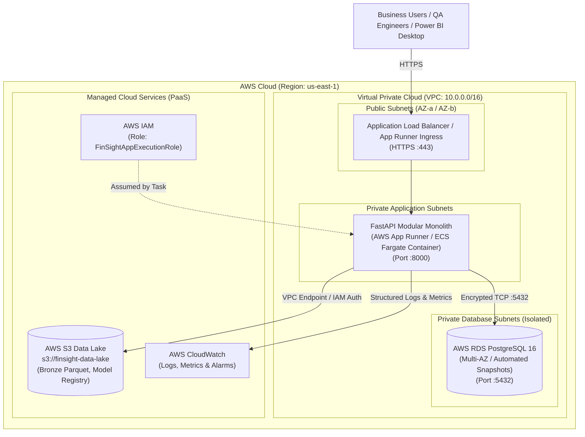

# FinSight Enterprise — Cloud Deployment Architecture & AWS Service Strategy

---

### 1. Cloud Positioning & Delivery Model

FinSight Enterprise is architected as:

> **"An enterprise financial analytics, lending validation, and QA platform deployed using cloud PaaS services with IaaS infrastructure where control is required."**

- **Why Not SaaS?** SaaS is a commercial software sales delivery model requiring end-customer subscription billing, multi-tenant public sign-up, and marketing funnels. FinSight is an **internal enterprise analytics, operations, and quality intelligence platform** designed for financial institution employees (CFO, Controllers, QA Engineers, Servicing Leads).
- **Why PaaS-First?** Managed PaaS services eliminate undifferentiated heavy lifting (server provisioning, OS security patching, database backup maintenance, certificate management), allowing teams to focus on financial mathematics, test automation, data modeling, and business logic.
- **Why Selective IaaS?** IaaS primitives (VPC, private subnets, security groups, IAM least-privilege policies) provide enterprise network isolation and regulatory boundary compliance required for banking platforms.

---

### 2. AWS Cloud Mapping vs. Local Zero-Cost Dev Stack

To keep the platform portfolio-ready, reliable, and completely free of recurring cloud bills during development, every AWS component has an exact local containerized counterpart:

| Architectural Tier | AWS Production Target (PaaS / IaaS) | Local Development Parity | Decision & Cost Rationale |
| :--- | :--- | :--- | :--- |
| **Application Compute** | **AWS App Runner** or **ECS Fargate** *(PaaS)* | Docker Container (`python:3.13-slim`) | PaaS serverless container execution eliminates VM maintenance; local Docker matches container image 1:1. |
| **Relational Database** | **AWS RDS PostgreSQL 16** (`db.t4g.micro`) *(PaaS)* | Docker Container (`postgres:16-alpine`) | Managed backups, automated patching, and SSL connections; local PostgreSQL ensures 100% SQL & DDL compatibility. |
| **Data Lake Storage** | **AWS S3** (`s3://finsight-data-lake/`) *(PaaS)* | Local `data/raw/` filesystem (Parquet) | S3 provides immutable object tiering for raw FRED & loan snapshots; local filesystem avoids cloud egress fees. |
| **Network Isolation** | **AWS VPC + Security Groups** *(IaaS)* | Docker Bridge Network (`finsight-net`) | Multi-tier VPC (Public ingress, Private DB) isolates transactional data from the public internet. |
| **Identity & Access** | **AWS IAM Roles & Policies** *(IaaS)* | Environment variable configuration (`.env`) | IAM least-privilege execution roles (`FinSightAppRole`, `FinSightPipelineRole`) govern access without hardcoded keys. |
| **Platform Monitoring**| **AWS CloudWatch** *(PaaS)* | Structured JSON Logging + `/metrics` endpoint | Centralized log group aggregation and alarm triggers on reconciliation failure spikes. |
| **Continuous Delivery**| **GitHub Actions** *(PaaS)* | Local Pytest & Make automation | Automated CI/CD pipeline executing test certification, linting, and Docker container build checks. |
| **BI Consumption** | **Power BI Desktop / Service** | Power BI Desktop (`.pbix`) | Direct ODBC/PostgreSQL connector consuming the Gold Star Schema. |

---

### 3. AWS Target Deployment Architecture (VPC & Service Topology)

---

### 4. Implementation Strategy: Developing Locally First

1. **Step 1: 100% Local Container Stack**
   - We write and run the full system using `docker-compose.yml` (`PostgreSQL`, `FastAPI`, `Pytest runner`).
   - All tests, migrations, and APIs execute locally on your machine with **$0 cloud cost**.
2. **Step 2: Infrastructure as Code (IaC) & Cloud Artifacts**
   - We provide clear Terraform / CloudFormation templates and deployment runbooks documenting how the local stack translates into AWS RDS, App Runner, S3, and IAM roles.
   - This allows you to speak in detail during interviews about AWS cloud architecture, network security, and infrastructure design without having to keep live, costly AWS resources running.
