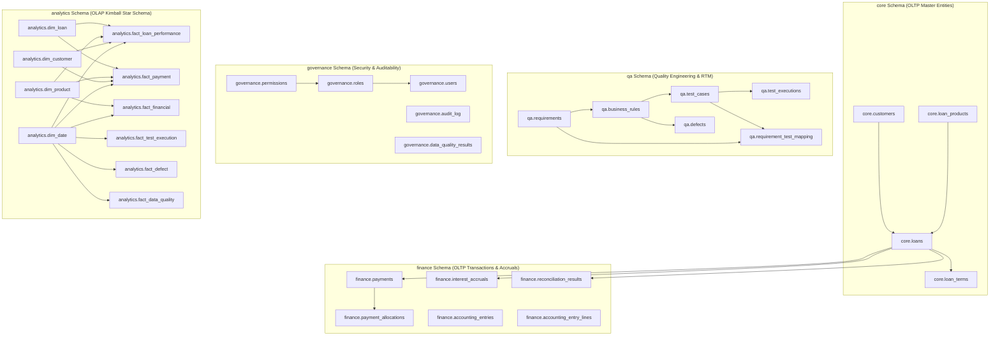
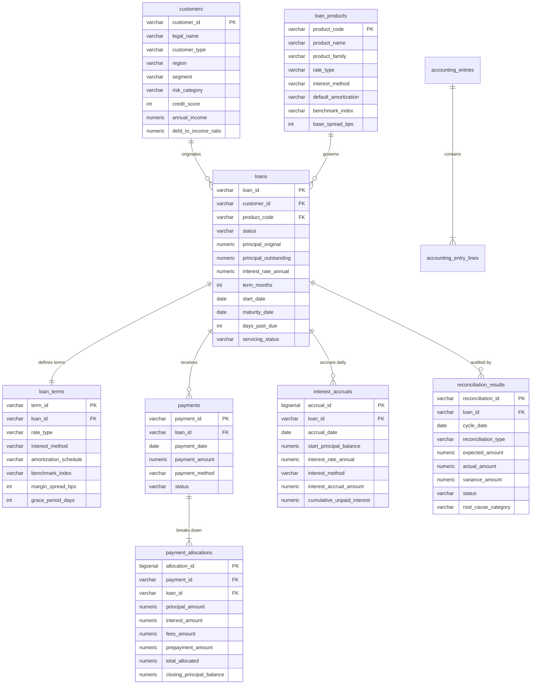
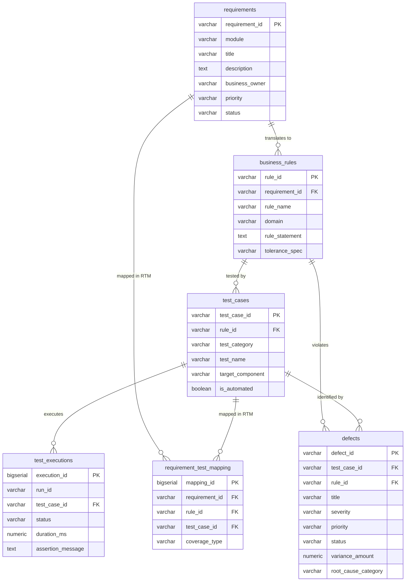
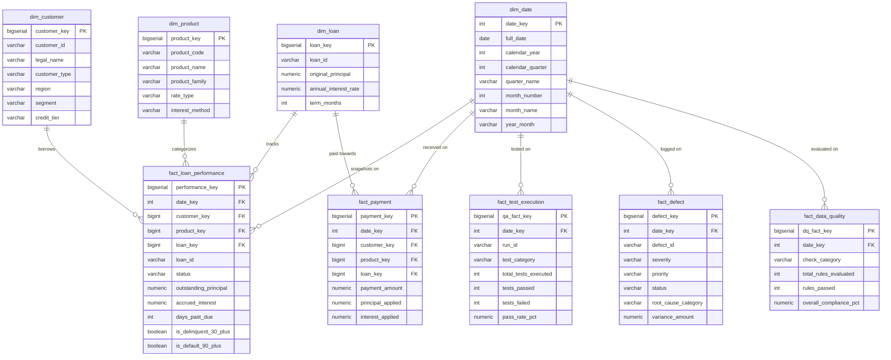

# FinSight Enterprise — Database Schema Specification & Entity Relationship Diagrams (ERD)

---

### 1. High-Level Schema Architecture

FinSight Enterprise organizes its database into five logical schemas adhering to a dual OLTP (3NF Operational) and OLAP (Kimball Star Schema) architecture:

---

### 2. Operational Schema ERD (`core` & `finance`)

---

### 3. Quality Assurance & RTM Schema ERD (`qa`)

---

### 4. Dimensional Star Schema ERD (`analytics`)

---

### 5. Data Integrity & Constraint Rules

1. **Exact Currency Representation**: All monetary values use `NUMERIC(18, 4)` to guarantee exact decimal arithmetic and eliminate IEEE 754 floating-point rounding errors.
2. **Balanced Double-Entry Accounting**: `finance.accounting_entries` enforces `total_debit = total_credit` via check constraint.
3. **Cash Conservation in Payment Waterfall**: `finance.payment_allocations` strictly enforces `total_allocated = (principal_amount + interest_amount + fees_amount + prepayment_amount)`.
4. **Credit Score Bounds**: `core.customers` check constraint guarantees `credit_score BETWEEN 300 AND 850`.
5. **Requirements to Test Traceability**: Unique constraint on `qa.requirement_test_mapping(requirement_id, test_case_id)` enforces non-duplicate RTM mapping.
