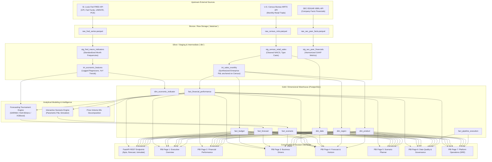

# FinSight — End-to-End Data Lineage & Governance Map

---

### 1. Visual Data Lineage

---

### 2. Lineage Audit & Governance Matrix

| Target Entity | Grain | Direct Upstream Parents | Transformation Logic | Refresh Frequency | Criticality |
| :--- | :--- | :--- | :--- | :--- | :--- |
| `raw_census_mrts` | Monthly, NAICS Code | U.S. Census Bureau API | Ingestion script with idempotency, JSON parsing, Parquet caching | Monthly | High |
| `raw_fred_series` | Monthly, Series ID | St. Louis Fed FRED API | Rate-limited API fetch, date alignment | Monthly | High |
| `raw_sec_peer_facts`| Quarterly, CIK, Concept | SEC EDGAR API | User-agent compliant XBRL extractor | Quarterly | Medium |
| `stg_census_retail_sales`| Monthly, NAICS Code | `raw_census_mrts` | Cleaned nulls, cast numeric dollar values, unpivot categories | On Ingestion | High |
| `stg_fred_macro_indicators`| Monthly, Series ID | `raw_fred_series` | Fill missing observations, compute MoM/YoY growth rates | On Ingestion | High |
| `fact_financial_performance`| Month, Region, Product, Channel | `int_sales_monthly`, `dim_date`, `dim_region`, `dim_product` | Enterprise P&L synthesis anchored to Census category volumes with regional variance | Nightly | Critical |
| `fact_budget` | Month, Region, Product | `int_sales_monthly` | Baseline annual budget targets (actuals $\pm$ plan growth assumptions) | Annual / Quarterly | Critical |
| `fact_forecast` | Month, Product, Model | `fact_financial_performance`, `int_economic_features` | Backtested tournament model inference (champion model selection) | Monthly | Critical |
| `fact_scenario` | Scenario, Month, Product | `fact_financial_performance` | Parametric stress shocks (Volume, Price, COGS, OpEx) | On Demand / Batch | High |
| `fact_pipeline_execution`| Pipeline Run | Ingestion, dbt, and ML pipelines | Telemetry logging of status, rows processed, tests passed, runtime | Real-Time | High |
